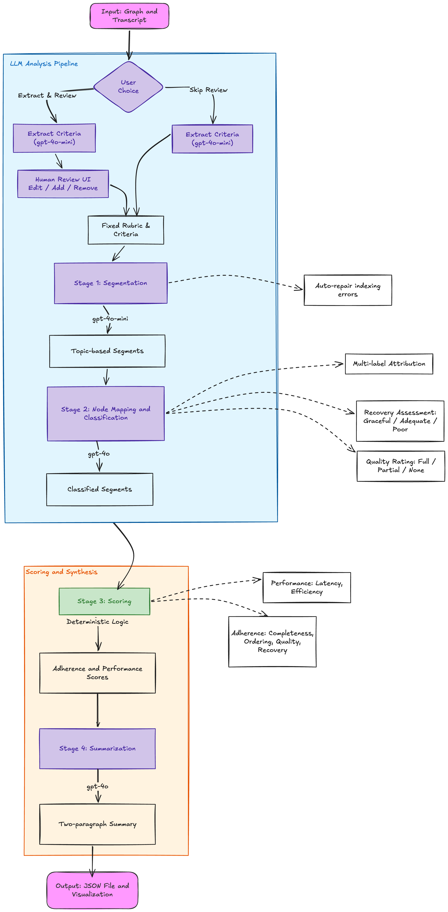

# Workflow Verification Engine

A system that evaluates whether a conversational AI agent followed a prescribed workflow correctly during a conversation. Given a workflow graph (the expected flow) and a conversation transcript, it produces adherence scores, performance metrics, per-node quality assessments, and a human-readable summary.


## Quick Start

```bash
# Install dependencies
npm install
cd visualization && npm install && cd ..

# Configure API key
cp .env.example .env
# Edit .env and add your OpenAI API key

# Run the pipeline against example data
npm start

# Run against custom data
node src/index.js --graph data/custom-graph.json --transcript data/custom-transcript.json

# Run the API server (for the visualization's Evaluate mode)
npm run server

# Launch the visualization UI
cd visualization && npm run dev

# Run tests
npm test
```

## Architecture



## Approach

### Problem Decomposition

The core challenge is mapping unstructured conversation text to structured workflow nodes, then scoring how well the agent followed the script. I broke this into a **multi-pass LLM pipeline** where each stage has a single, well-scoped responsibility:

```
Input (Graph + Transcript)
  |
  v
[Pre-pass] Criteria Extraction (LLM: gpt-4o-mini, parallelized)
  -> Extracts testable criteria from each node's description
  -> Creates a fixed rubric for downstream classification
  |
  v
[Stage 1] Segmentation (LLM: gpt-4o-mini)
  -> Groups transcript turns into topic-based segments
  -> Auto-repairs small gaps from LLM indexing errors
  |
  v
[Stage 2] Node Mapping / Classification (LLM: gpt-4o, parallelized)
  -> Classifies each segment to workflow node(s) or "off_workflow"
  -> Rates quality against pre-extracted criteria: full / partial / none
  -> Assesses recovery for off-workflow segments: graceful / adequate / poor
  -> Supports multi-label segments with per-turn attribution
  |
  v
[Stage 3] Scoring (Deterministic, no LLM)
  -> Adherence Score (0-100): completeness, ordering, quality, recovery
  -> Performance Score (0-100): latency, efficiency
  |
  v
[Stage 4] Summarization (LLM: gpt-4o)
  -> Human-readable two-paragraph summary
  |
  v
Output: JSON result file + visualization
```

### Why Multi-Pass Instead of Single-Pass?

A single LLM call that segments, classifies, and scores simultaneously would suffer from "lost in the middle" hallucination on long transcripts and conflate separate concerns. By splitting into passes:

- **Segmentation** can use a cheaper model (gpt-4o-mini) since grouping turns by topic is a simpler task
- **Classification** gets isolated segments with context windowing, enabling parallel calls
- **Scoring** is fully deterministic with no LLM involvement, making it testable and reproducible
- Each stage's output can be inspected independently for debugging

### Why Criteria Extraction as a Pre-Pass?

Node descriptions like *"For new patients: Ask for full name, date of birth, and contact number"* contain multiple implicit criteria. Without pre-extraction, the classifier invents criteria on the fly during each run, leading to inconsistent quality assessments. The pre-pass converts descriptions into fixed, testable criteria (e.g., "Ask for full name (if new patient)", "Ask for date of birth (if new patient)") that the classifier checks against deterministically.

This also handles **conditional criteria** -- criteria that only apply under certain conditions are tagged with `(if ...)` suffixes, and the classifier skips them when the condition doesn't apply.

## Design Decisions

### 1. Mapping Conversation Content to Workflow Nodes

**Decision**: Segment-level classification with multi-label support and per-turn attribution.

The transcript is first grouped into topic-based segments (5-10 turns each), then each segment is independently classified against workflow nodes. This is better than turn-level classification (too granular -- single turns rarely complete a workflow step) or whole-transcript classification (too coarse -- loses position information).

When a segment straddles two workflow nodes (e.g., the last scheduling turn and the first wrap-up turn), the classifier returns both node IDs with a `turnBreakdown` that specifies exactly which turns belong to which node, preventing one node from claiming turns that don't belong to it.

**"Doing vs. talking about" distinction**: The classification prompt explicitly distinguishes between an agent *performing* a workflow step and merely *talking about* it. For example, if a frustrated customer asks "how does scheduling work?" and the agent explains the process, that's not the same as actually scheduling -- it's off-workflow recovery.

### 2. What Constitutes "Correct" Traversal

**Decision**: Two complementary scores measuring different dimensions.

**Workflow Adherence Score (0-100)** answers: "Did the agent follow the right steps?"
- **Completeness (30%)**: Were all required nodes visited? Uses the best matching path through the graph to distinguish required vs. optional nodes (e.g., Error Handling is only needed if errors occur).
- **Ordering (25%)**: Were nodes visited in a valid sequence? Uses longest valid subsequence against the graph's edge definitions.
- **Quality (25%)**: How thoroughly did the agent execute each node? Based on pre-extracted criteria -- full (all met), partial (some met), none (topic touched but purpose not served).
- **Recovery (20%)**: How well did the agent handle off-workflow detours? Rated graceful/adequate/poor based on empathy, acknowledgment, and redirection.

**Performance Score (0-100)** answers: "Was the agent fast and efficient?"
- **Latency (50%)**: Average response time, with violations flagged for gaps > 10 seconds.
- **Efficiency (50%)**: Turns per required node -- fewer turns for the same outcome is better.

### 3. Handling Edge Cases

**Off-workflow detours**: When a user goes off-script (complaints, tangential questions), the system classifies those segments as `off_workflow` and evaluates the agent's recovery quality. Good recovery (empathy + redirect) doesn't penalize the adherence score.

**Repeated nodes / loops**: The system tracks `visit_sequence` (chronological with repeats) separately from `visited_path` (deduplicated). A node counts as revisited only if a different node was visited in between -- consecutive segments for the same node count as one visit.

**Skipped nodes**: Nodes on the best matching path that weren't visited are marked `skipped` and reduce the completeness score. Nodes not on the best path (e.g., Error Handling when no errors occurred) are marked `not_needed` and don't penalize.

**Branching workflows**: The graph can have branches (e.g., Scheduling -> Error Handling -> Wrap-up vs. Scheduling -> Wrap-up). The system uses DFS path enumeration to find all valid start-to-end paths, then picks the one with highest overlap to what the agent actually did.

**Low confidence classifications**: When the classifier's confidence falls below 0.6, the result is flagged `needsReview` for human inspection. The aggregate count is surfaced in the output.

### 4. Structured Output Over Prompt-Based Parsing

All LLM calls that return structured data use OpenAI's `response_format: json_schema` enforcement. This guarantees valid JSON with required fields, eliminating parsing failures and reducing hallucinated fields.

### 5. Configuration Over Hardcoding

All scoring weights, model selections, thresholds, and penalty multipliers are centralized in `src/config.js`. This makes it straightforward to tune the system for different use cases without modifying scoring logic.

## Output Structure

The pipeline produces a JSON result with:

```json
{
  "workflow_adherence_score": 96,
  "adherence_scores": {
    "completeness": 1.0,
    "ordering": 1.0,
    "quality": 0.85,
    "recovery": 1.0
  },
  "performance_score": 75,
  "performance_scores": {
    "latency": 0.75,
    "efficiency": 0.75
  },
  "best_matching_path": ["1", "2", "3", "5"],
  "visited_path": ["1", "2", "3", "5"],
  "visit_sequence": [ ... ],
  "segments": [ ... ],
  "node_results": [
    {
      "nodeId": "1",
      "label": "Introduction",
      "status": "visited",
      "quality": "full",
      "qualityCriteria": { "met": [...], "not_met": [...] },
      "turns": [0, 1],
      "visits": [...]
    },
    ...
  ],
  "off_workflow_segments": [ ... ],
  "qualitative_summary": "..."
}
```

### Example Output (NexaCare Scheduling)

Running against the provided example data:

| Metric | Score |
|--------|-------|
| Workflow Adherence | 96/100 |
| Performance | 75/100 |

| Node | Status | Quality |
|------|--------|---------|
| Introduction | Visited | Full |
| Appointment Type Determination | Visited | Full |
| Scheduling Process | Visited | Full |
| Error Handling | Not needed | -- |
| Confirmation and Wrap-up | Visited | Full |

The agent followed all required steps in the correct order with full quality. Two off-workflow detours (user complaints about a previous visit) were handled gracefully. Performance was moderate due to response latency spikes (max 24.6s) and 24 total turns.

## Visualization

The visualization is a React + Vite + Tailwind app with two modes:

**Example mode**: Loads pre-computed results from `output/example-result.json` for instant viewing.

**Evaluate mode**: Accepts custom graph + transcript JSON, sends it to the API server, and displays live results.

Three main views:

1. **Workflow Graph** -- SVG-based graph showing the agent's path with animated edges, visit count badges for looped nodes, and color-coded node status.
2. **Score Dashboard** -- Circular gauge charts for adherence and performance, expandable metric bars with auto-generated explanations, and per-node cards with visit history and criteria breakdowns.
3. **Annotated Transcript** -- Full conversation grouped by segments, color-coded by node mapping. Each turn shows its workflow label(s), timestamps, and latency gaps between turns. Multi-label turns display all applicable node labels.

## Project Structure

```
workflow-verifier/
  src/
    index.js                # Pipeline orchestrator
    server.js               # Express API server (port 3001)
    config.js               # All weights, thresholds, model config
    engine/
      criteriaExtractor.js  # Pre-pass: extract criteria from node descriptions
      segmenter.js          # Stage 1: group turns into segments
      nodeMapper.js         # Stage 2: classify segments to nodes
      scorer.js             # Stage 3: compute adherence + performance scores
      summarizer.js         # Stage 4: generate qualitative summary
      graphUtils.js         # DFS path enumeration, ordering validation
    prompts/
      criteriaExtraction.js # Criteria extraction prompt + schema
      segmentation.js       # Segmentation prompt + schema
      classification.js     # Classification prompt + schema
      summary.js            # Summary prompt builder
    llm/
      client.js             # OpenAI SDK wrapper with retry logic
  tests/
    scorer.test.js          # Scoring logic unit tests
    segmenter.test.js       # Segmentation tests
    nodeMapper.test.js      # Classification orchestration tests
    graphUtils.test.js      # Graph utility tests
    test-segmenter.js       # Additional segmenter tests
  data/
    example-graph.json      # NexaCare scheduling workflow (5 nodes)
    example-transcript.json # 24-turn conversation with off-workflow detours
    looping-graph.json      # Tech support workflow with cycles (5 nodes)
    looping-transcript.json # 35-turn conversation with diagnostic loops
    test-scripts/           # Edge case transcripts (hallucination, rude, incomplete)
  output/
    example-result.json     # Pre-computed result for visualization
  assets/
    demo.gif                # Demo recording
    workflow-image.png      # Architecture diagram
  design-iterations/        # Design docs showing evolution of the approach
  visualization/
    src/
      App.jsx               # Main app with Example/Evaluate modes
      components/
        WorkflowGraph.jsx   # SVG workflow visualization
        ScoreDashboard.jsx  # Score gauges and metric bars
        TranscriptView.jsx  # Annotated transcript view
        EvaluationInput.jsx # Custom graph/transcript input form
        CriteriaReview.jsx  # Human-in-the-loop criteria review UI
```

## Testing

Tests use Jest with mocked LLM calls, keeping them fast and deterministic:

```bash
npm test
```

The test suite covers:
- **Scorer** (~22KB): Perfect paths, skipped nodes, wrong ordering, partial quality, recovery, branching paths, penalties
- **Segmenter**: Segment grouping and gap repair
- **Node Mapper**: Orchestration, context windowing, confidence flagging, multi-label handling, ID normalization
- **Graph Utils**: Path enumeration, valid transitions, best path matching

## Assumptions

1. **Transcript is chronological**: Turns are ordered by timestamp and represent a single continuous conversation.
2. **Workflow graph is a DAG with optional cycles**: The graph can have branches and loops, but must have at least one start node and one end node.
3. **One conversation = one workflow traversal**: The system evaluates a single pass through the workflow. Multiple independent conversations should be evaluated separately.
4. **Node descriptions are the source of truth**: The system extracts evaluation criteria from node descriptions. More detailed descriptions produce better quality assessments.
5. **Off-workflow is not inherently bad**: Users going off-script is normal. What matters is how the agent recovers and redirects.

## Tradeoffs

| Decision | Benefit | Cost |
|----------|---------|------|
| Multi-pass LLM pipeline | Each stage is independently testable and debuggable | More API calls, higher latency (~15-20s total) |
| Criteria pre-extraction | Consistent quality scoring across runs | Extra LLM call per node at pipeline start |
| Segment-level (not turn-level) classification | Better context for classification decisions | Can't split mid-segment when a turn straddles nodes (mitigated by turnBreakdown) |
| Deterministic scoring | Reproducible, testable, no LLM variance | Weights and thresholds need manual tuning |
| gpt-4o for classification, gpt-4o-mini for segmentation | Cost optimization without sacrificing accuracy where it matters | Segmentation errors cascade downstream |
